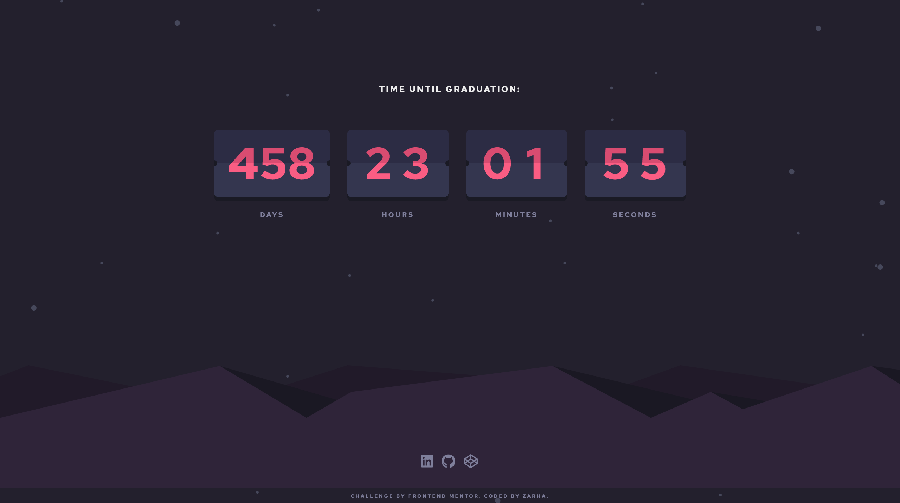

# Frontend Mentor - Launch countdown timer solution

This is a solution to the [Launch countdown timer challenge on Frontend Mentor](https://www.frontendmentor.io/challenges/launch-countdown-timer-N0XkGfyz-). Frontend Mentor challenges help you improve your coding skills by building realistic projects.

## Table of contents

- [Overview](#overview)
  - [The challenge](#the-challenge)
  - [Screenshot](#screenshot)
  - [Links](#links)
- [My process](#my-process)
  - [Built with](#built-with)
  - [What I learned](#what-i-learned)

## Overview

### The challenge

Users should be able to:

- See hover states for all interactive elements on the page
- See a live countdown timer that ticks down every second (start the count at 14 days)
- **Bonus**: When a number changes, make the card flip from the middle

### Screenshot



### Links

- Live Site URL: (https://zarhaselene.github.io/countdown)

## My process

### Built with

- Semantic HTML5 markup
- CSS custom properties
- Flexbox
- CSS Grid
- Mobile-first workflow

### What I learned

Working on this project, I gained a deeper understanding of several key concepts:

1. **JavaScript Date and Time Manipulation**: I improved my skills in manipulating dates and times in JavaScript. I used the `setInterval` function to update the countdown timer every second:

```js
const countdown = () => {
  const now = new Date();
  const targetDate = new Date("YYYY-MM-DDTHH:MM:SS");
  const timeDifference = targetDate - now;

  // Calculate days, hours, minutes, and seconds
  const days = Math.floor(timeDifference / (1000 * 60 * 60 * 24));
  const hours = Math.floor(
    (timeDifference % (1000 * 60 * 60 * 24)) / (1000 * 60 * 60)
  );
  const minutes = Math.floor((timeDifference % (1000 * 60 * 60)) / (1000 * 60));
  const seconds = Math.floor((timeDifference % (1000 * 60)) / 1000);

  // Update the DOM
  document.getElementById("days").innerText = days;
  document.getElementById("hours").innerText = hours;
  document.getElementById("minutes").innerText = minutes;
  document.getElementById("seconds").innerText = seconds;
};

setInterval(countdown, 1000);
```

2. **CSS Animations**: I learned how to create card flip animations using CSS. This was particularly useful for the bonus challenge of making the countdown numbers flip from the middle when they change.

3. **Responsive Design**: I practiced building a responsive layout using mobile first approach, ensuring that the countdown timer looks good on both mobile and desktop screens.
